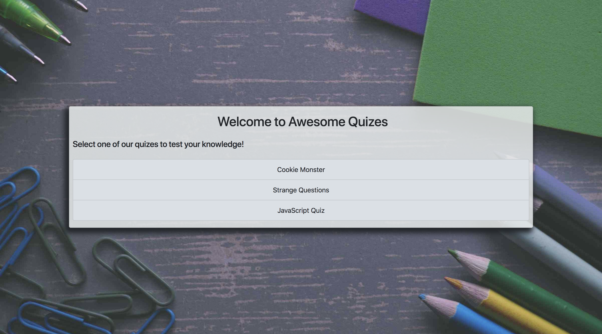

# Trivia Game Engine    
[Visit the app](https://germangamboa95.github.io/TrivaGame.io/)

The aim of this project is to create an engine that can render a trivia game. The engine will take in a json object and render the questions.

## Facts about this project
* It uses the Giphy api.
* It was created with the intention of being a basic quiz render engine.
* It was created with a backend being added later on since the quizzes are not hard coded in.

## Dev Log

The MVP is done. We are now organizing the project for future features.

- [X] Include bootstrap locally to reduce load time.
- [X] Include jQuery locally to reduce load time.
- [X] Compress background image to meet lighthouse recomendation.
- [X] Move quizzes to their own folder. 
